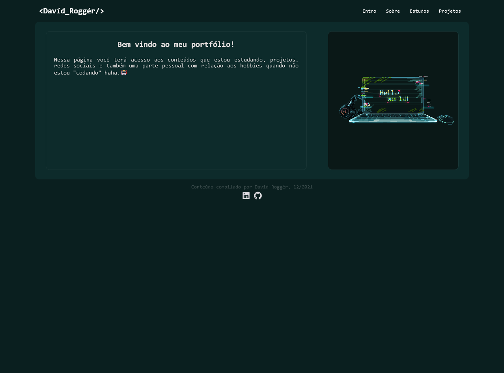

# Portifolio - <DavídRoggér />

## Versão 00

  

#

>Usando meus conhecementos usando apenas HTML, CSS e javascript.
>E com ajuda do github actions realizei o deploy da minha primeira página com algumas >informação e dados pessoais no final de 2021.
